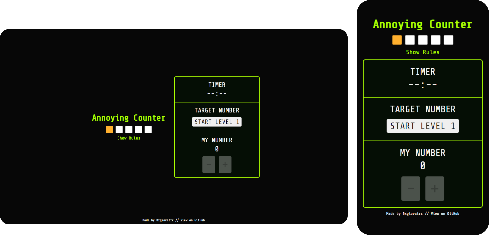

# Annoying Counter // *by 0xgiovatrc*

Welcome to the *Annoying Counter* Game! Embrace the challenge of simplicity and test your quick-clicking skills.

<a href="https://0xgiovatrc.github.io/annoyingCounter/">➡️ PLAY THE ANNOYING COUNTER</a>  
<a href="https://drive.google.com/file/d/1t2ugt4Na38EULn4m8NrfJ1UIwux7FmzZ/view?usp=sharing">📜 READ PRESENTATION (Italian)</a>

## Gameplay

1. **Generate Level:**
   - Click on the *GENERATE LEVEL* button to kick off a new level.

2. **Make My Number Equal to Target Number:**
   - Use the provided increment (+) and decrement (-) buttons to make *MY NUMBER* equal to the *TARGET NUMBER*.

3. **Wait for the Timer:**
   - Complete the level swiftly. Each level has a time limit to keep you on your toes.

4. **Complete All the Levels:**
   - Your ultimate challenge is to successfully conquer all the levels in a row to emerge victorious and get the **Marvelous Final Prize**.

5. **Restart on Failure:**
   - Fail a level? You'll restart from the beginning. Persistence is key if you want to overcome the *Annoying Counter*!

## Technologies Used

- **HTML:** The backbone of the game.
- **CSS:** Stylish touches to enhance the gaming experience.
- **JavaScript:** The brain behind the *Annoying Counter*'s tricky logic.

## File Structure

- `index.html`: The main HTML file providing the game's structure.
- `styles.css`: The CSS file styling the game for an enjoyable visual experience.
- `script.js`: The JavaScript file containing the *Annoying Counter*'s challenging logic.

## Acknowledgments

- The *Annoying Counter Game* is designed to be both frustrating and entertaining.
- Inspired by the spirit of simplicity and challenge in similar games.
